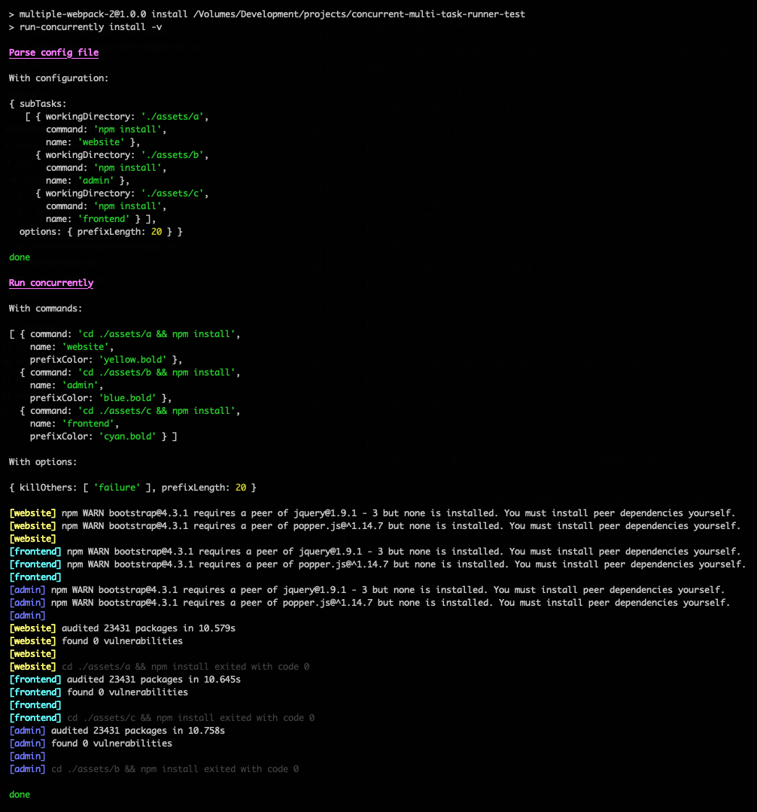

# `@gnoesiboe/run-concurrently`

Node cli task that uses [`concurrently`](https://www.npmjs.com/package/concurrently) combined with a JSON configuration in `package.json` or separate file, to make concurrent tasks better readable and easier to configure. It for instance can be used to build a project in one command, when it consists of separate individual applications. Within our organisation we use it for starting and maintaining several development servers with one command.

;

## Installation

```bash
npm install --save-dev @gnoesiboe/run-concurrently
```

## Usage

1. Add your task configuration to your application's `package.json` or separate json file.
2. Use the cli command to execute the tasks concurrently
3. Setup shortcuts in the root of your application for easier execution (for instance `scripts` in `package.json` or `make`)

### Configuration

Can be placed in `package.json`, located in the location that this task is run from:

_Format:_

```json
{
    ...,
    "concurrentTasks": {
        "<task_name>": {
            "subTasks": [
                {
                    "workingDirectory": "<directory_to_execute_code_in>",
                    "command": "<command_to_execute_in_working_directory>",
                    "name": "<prefix_that_is_used_to_distinguish_seperate_tasks_output>"
                },
                ...
            ]
        }
    }
}
```

Example, added to `package.json`:

```json
{
    ...,
    "concurrentTasks": {
        "build": {
            "subTasks": [
                {
                    "workingDirectory": "./assets/a",
                    "command": "npm run build",
                    "name": "website"
                },
                {
                    "workingDirectory": "./assets/b",
                    "command": "npm run build",
                    "name": "admin"
                },
                {
                    "workingDirectory": "./assets/c",
                    "command": "npm run build",
                    "name": "frontend"
                }
            ],
            "options": {
                "prefixLength": 20
            }
        },
        "build:watch": {
            "subTasks": [...]
        }
    }
}
```

You can also place the configuration outside the `package.json` and into a separate JSON file. For this task to find it, you have to use the `--config` option to supply the server path to it. See below for more information.

### CLI command usage

#### Arguments

| name   | description                                | type     | required | default value |
| ------ | ------------------------------------------ | -------- | -------- | ------------- |
| `task` | The task to execute from the configuration | `string` | `false`  | 'build'       |

#### Options

| name                | description                                                  | type     | required | default value                                         |
| ------------------- | ------------------------------------------------------------ | -------- | -------- | ----------------------------------------------------- |
| `--config` or `-c`  | Path to an alternate configuration file that you want to use | `string` | `false`  | fallback on package.json in current working directory |
| `--help` or `-h`    | Prints information about how to use this cli command         | na.      | `false`  | na.                                                   |
| `--verbose` or `-v` | If flagged with verbose, extra debug output is displayed     | na.      | `false`  | na.                                                   |


### Running the command

With configuration in `package.json`:

```bash
./node_modules/.bin/run-concurrently <command> --verbose
```

With separate configuration file:

```bash
./node_modules/.bin/run-concurrently <command> --config=/path/to/config.json --verbose
```

Often it easier to alias it in a NPM script, like:


```json
// package.json

{
    "scripts": {
        "<command>": "run-concurrently <command>"
    }
}
```

---

## Development

Install dependencies:

```bash
npm install
```

### Running tests

Run tests by executing:

```bash
npm run test
```

Or in watch mode:

```bash
npm run test:watch
```
